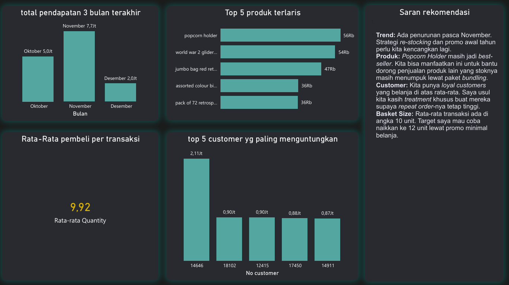

# UK E-Commerce Sales Analysis Dashboard 🚀
> Interactive Power BI Dashboard for analyzing 500k+ retail transactions.

## 📌 Project Background
Project ini menganalisis dataset transaksi e-commerce ritel online yang berbasis di Inggris. Fokus utamanya adalah mengubah data mentah (raw data) menjadi dashboard yang memberikan insight tentang profitabilitas, tren penjualan, dan perilaku pelanggan.

## 🛠️ Tech Stack & Tools
*   **Power BI:** Visualisasi Data & Dashboarding.
*   **Power Query (M Language):** Data Cleaning & Transformation.
*   **DAX (Data Analysis Expressions):** Advanced Calculations & Metrics.
*   **Dataset:** UK E-Commerce dataset (500,000+ rows).

## 🏗️ Data Processing (The "How-To")
Meskipun ini project Analyst, saya menerapkan langkah-langkah terstruktur dalam pengolahan data:
1.  **Data Cleaning:** Menghapus entri tanpa `CustomerNo` dan memisahkan transaksi sukses dengan pembatalan (kode 'C').
2.  **Feature Engineering:** Membuat kolom baru untuk *Total Sales* (Quantity * Price) dan *Order Status*.
3.  **Data Modeling:** Mengatur hubungan antar tabel (Star Schema) untuk memastikan performa dashboard yang cepat meski data mencapai 500k baris.

## 📊 Key Findings
*   **Trend Penjualan:** Identifikasi bulan-bulan dengan kenaikan volume transaksi tertinggi.
*   **Product Performance:** Daftar produk paling menguntungkan vs produk yang paling sering dibatalkan karena stok habis.
*   **Geographic Analysis:** Pemetaan sebaran pelanggan global yang berbelanja di UK.

## 🖥️ Dashboard Preview

*(Tips: Upload screenshot dashboard lu ke folder project, lalu panggil di sini agar orang langsung bisa lihat visualnya tanpa download file .pbix)*

---
**Next Step (Transitioning to Data Engineering):**
Kedepannya, saya berencana mengembangkan project ini menjadi automated data pipeline menggunakan Python dan SQL untuk mengotomatisasi proses ingestion data langsung dari database.
