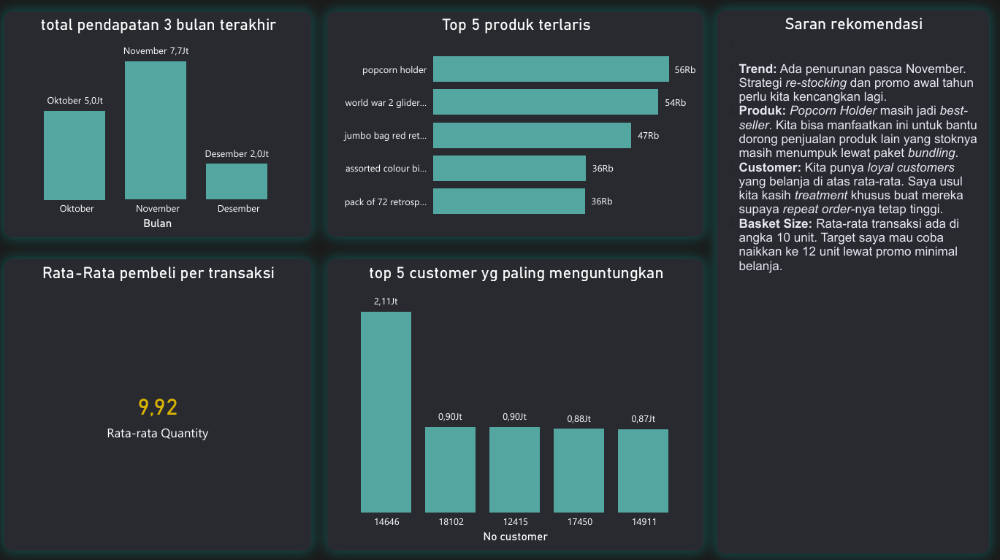

# UK E-Commerce Sales Analysis Dashboard 🚀

Interactive Power BI dashboard built to analyze over 500,000 online retail transactions and uncover insights into sales performance, customer behavior, and product profitability.

---

## 📌 Project Overview

This project analyzes a UK-based online retail dataset and transforms raw transactional data into an interactive dashboard for business analysis.

The objective is to provide actionable insights into sales trends, customer purchasing behavior, and product performance through data visualization and reporting.

---

## 🛠️ Tech Stack

- Power BI
- Power Query (M Language)
- DAX (Data Analysis Expressions)
- Microsoft Excel
- UK E-Commerce Dataset (500,000+ Rows)

---

## 🏗️ Data Processing Workflow

The dataset was processed through a structured workflow to ensure data quality and analytical accuracy.

### Data Cleaning

- Removed records with missing customer identifiers
- Separated canceled transactions (Invoice IDs starting with "C")
- Handled missing and invalid values

### Feature Engineering

Created additional business metrics including:

- Total Sales (`Quantity × Unit Price`)
- Order Status (Completed / Canceled)

### Data Modeling

- Built relationships between tables using a Star Schema approach
- Optimized the model for dashboard performance and scalability

---

## 📊 Dashboard Insights

### Sales Trends

- Identified peak sales periods and monthly transaction patterns
- Analyzed revenue fluctuations over time

### Product Performance

- Determined top-performing products based on sales revenue
- Identified products with high cancellation rates

### Customer Analysis

- Explored customer purchasing behavior
- Identified repeat customers and high-value buyers

### Geographic Analysis

- Visualized customer distribution across different countries
- Analyzed regional sales performance

---

## 💼 Business Value

This dashboard helps stakeholders:

- Monitor sales performance
- Identify profitable products
- Understand customer purchasing patterns
- Support data-driven decision making

---

## 🖥️ Dashboard Preview

---

## 📈 Future Improvements

As I continue my transition toward Data Engineering, future enhancements may include:

- Building an automated ETL pipeline using Python
- Storing processed data in PostgreSQL
- Automating data ingestion and reporting workflows
- Creating a centralized data warehouse for analytics

---

## 📚 Key Skills Demonstrated

- Data Cleaning
- Data Transformation
- Data Modeling
- Dashboard Development
- Business Analysis
- Power BI
- DAX
- Data Visualization
